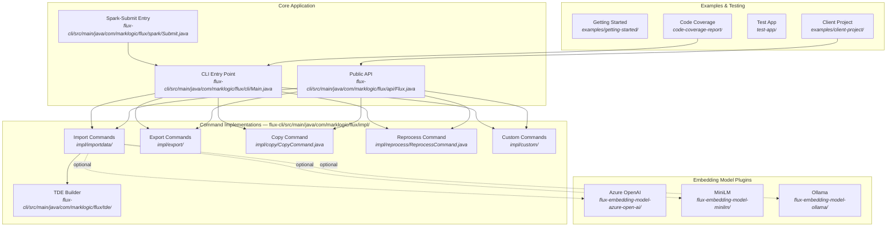
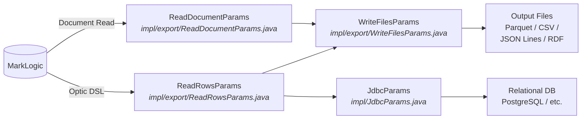
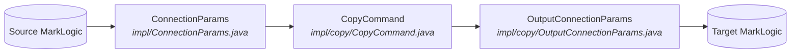
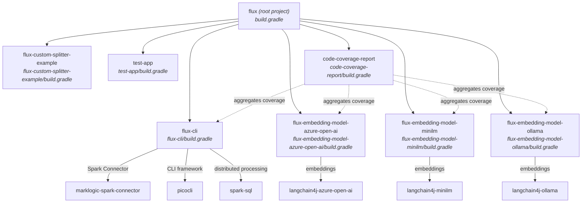

# Flux Architecture

This document maps the conceptual architecture of **MarkLogic Flux** to actual
file paths in the repository. Diagrams use [Mermaid](https://mermaid.js.org/) syntax.

---

## Module Overview

---

## Data Flow 1 — File Import into MarkLogic

Shows how files on disk (or cloud storage) are imported into MarkLogic.

```mermaid
flowchart LR
    FILES["Source Files<br/>JSON / XML / CSV /<br/>Parquet / Avro / RDF"]
    READ["ReadFilesParams<br/><i>impl/importdata/ReadFilesParams.java</i>"]
    SPLIT["SplitterParams<br/><i>impl/importdata/SplitterParams.java</i>"]
    EMBED["EmbedderParams<br/><i>impl/importdata/EmbedderParams.java</i>"]
    WRITE["WriteDocumentParams<br/><i>impl/importdata/WriteDocumentParams.java</i>"]
    ML[(MarkLogic)]

    FILES --> READ
    READ -->|Spark DataFrame| SPLIT
    SPLIT -->|chunked text| EMBED
    EMBED -->|vectors added| WRITE
    WRITE -->|Spark Connector| ML
```

---

## Data Flow 2 — Document Export from MarkLogic

Shows how documents or rows are exported from MarkLogic to files or a relational database.

---

## Data Flow 3 — Cross-Database Copy

Shows how documents are copied between two MarkLogic databases.

---

## Dependency Graph (Gradle Modules)

---

## Key File Reference

| Concept | File Path |
|---------|-----------|
| CLI entry point | `flux-cli/src/main/java/com/marklogic/flux/cli/Main.java` |
| Spark-submit entry | `flux-cli/src/main/java/com/marklogic/flux/spark/Submit.java` |
| Public API (factory) | `flux-cli/src/main/java/com/marklogic/flux/api/Flux.java` |
| Abstract command base | `flux-cli/src/main/java/com/marklogic/flux/impl/AbstractCommand.java` |
| Import files command | `flux-cli/src/main/java/com/marklogic/flux/impl/importdata/ImportFilesCommand.java` |
| Export Parquet command | `flux-cli/src/main/java/com/marklogic/flux/impl/export/ExportParquetFilesCommand.java` |
| Copy command | `flux-cli/src/main/java/com/marklogic/flux/impl/copy/CopyCommand.java` |
| Reprocess command | `flux-cli/src/main/java/com/marklogic/flux/impl/reprocess/ReprocessCommand.java` |
| Connection params | `flux-cli/src/main/java/com/marklogic/flux/impl/ConnectionParams.java` |
| JDBC params | `flux-cli/src/main/java/com/marklogic/flux/impl/JdbcParams.java` |
| Splitter params | `flux-cli/src/main/java/com/marklogic/flux/impl/importdata/SplitterParams.java` |
| Embedder params | `flux-cli/src/main/java/com/marklogic/flux/impl/importdata/EmbedderParams.java` |
| TDE builder | `flux-cli/src/main/java/com/marklogic/flux/tde/TdeBuilder.java` |
| CI pipeline | `Jenkinsfile` |
| Root build | `build.gradle` |
| Module registry | `settings.gradle` |
